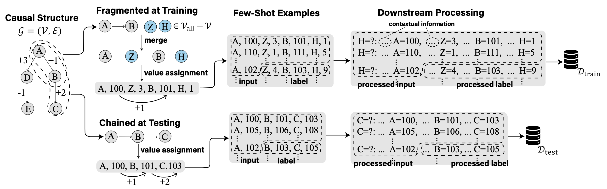

# Fragmented-at-Training-Chained-at-Testing
The code of  [ICLR 2025] **Are Transformers Able to Reason by Connecting Separated Knowledge in Training Data?** (https://arxiv.org/abs/2501.15857). 

It includes the code that generates the “FTCT” (Fragmented at Training, Chained at Testing) learning task and corresponding experiments. 

## Environment Setup
Run  ```pip install -r requirements.txt```.

## Experiments
All experiments are included in ```experiements.ipynb```. 

## Citation
```
@article{yin2025transformers,
  title={Are Transformers Able to Reason by Connecting Separated Knowledge in Training Data?},
  author={Yin, Yutong and Wang, Zhaoran},
  journal={arXiv preprint arXiv:2501.15857},
  year={2025}
}```