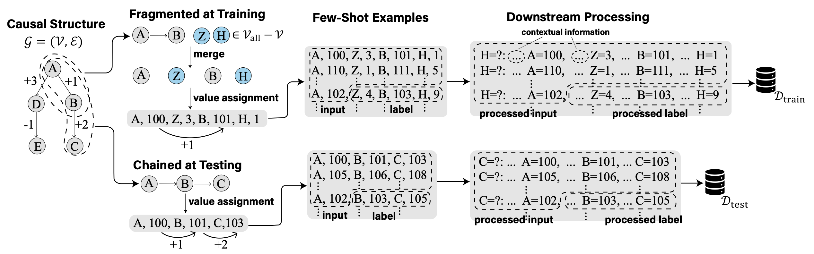
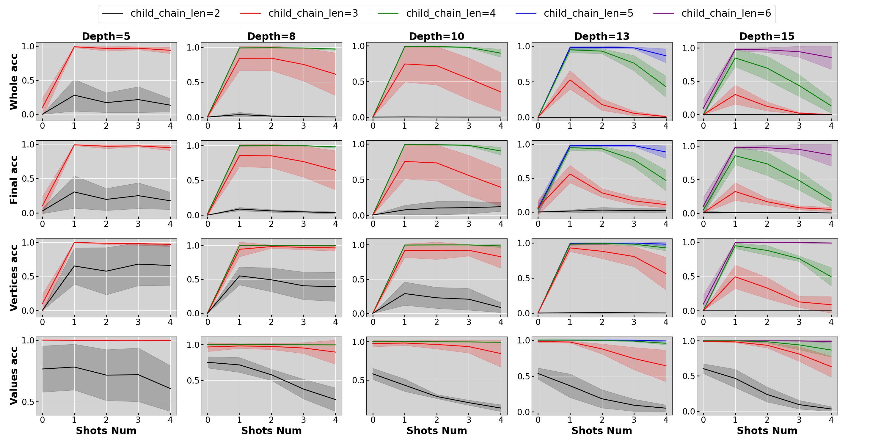
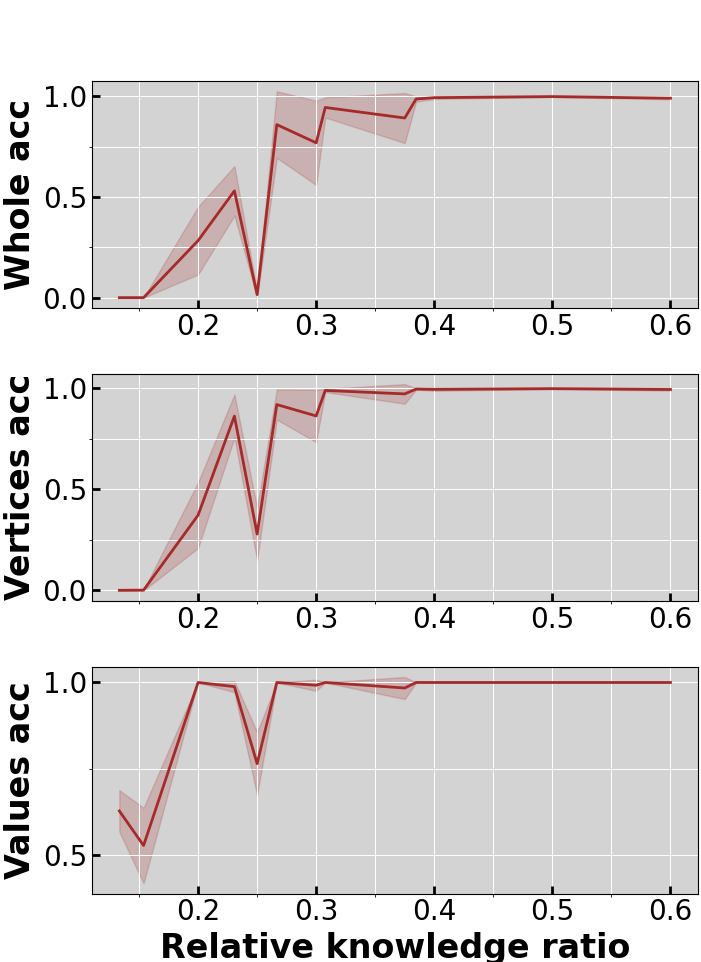
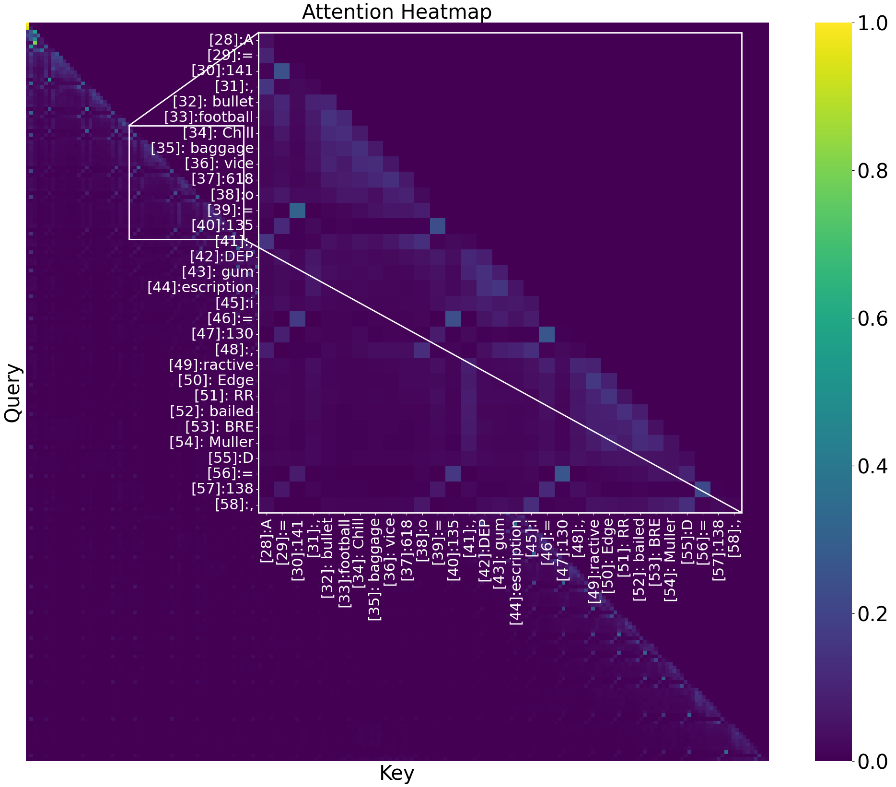
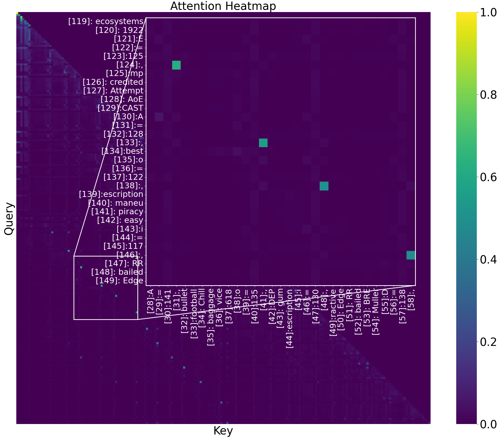
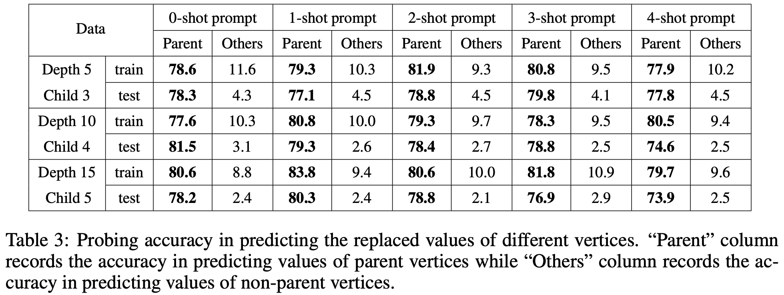

# Fragmented-at-Training-Chained-at-Testing
This is the repository of the paper [ICLR 2025] **Are Transformers Able to Reason by Connecting Separated Knowledge in Training Data?** (https://arxiv.org/abs/2501.15857). 
It includes the code that generates the “FTCT” (Fragmented at Training, Chained at Testing) learning task and corresponding experiments. 

## Environment Setup
Run  ```pip install -r requirements.txt```.

## Quick Start
By running ```quick_start.sh```, you can train and test Transformers on FTCT with depth 5 and child chain length 3. 

### Data Generation
Within ```quick_start.sh```, data generation is done by the following command.
```
python data_gen.py \
    --config-name config_normal.yaml\
    graph.len=$len \
    graph.type=$gt \
    data.max_child_chain_len=$child_len\
    paths.data_dir=$data_dir
```
It generates the data according to the procedure introduced in section 3 of the paper. 
After running, it creates the directory ```nodes_dir``` to store the causal structure and creates the directory ```data_and_models/quick_start/depth5_maxchild3/type0``` to store the training data.

### Training and Testing
Training and testing are done by the following command.
```
python main.py \
     --config-name config_normal.yaml\
    graph.len=$len \
    graph.type=$gt \
    data.max_child_chain_len=$child_len\
    paths.data_dir=$data_dir\
    modes.train=true\
    modes.test=true\
```

### Plotting
By running
```
python draw.py \
     --config-name config_normal.yaml\
    draw.parent_dir=$parent_dir\
    draw.mode=main\
    draw.model_size=quick_start
```
, you can draw the zero and few-shot testing performance of Transformers trained on FTCT with depth 5 and child chain length 3. This image will be stored in ```figures/fs_and_chain_len_quick_start.png```.


## Replicate Experiments

All experiments are included in ```experiements.ipynb```. 

### Main Results
We train 3-layer 3-head Transformers on FTCT with various causal depths and child chain lengths by the following commands.
```
scripts/train_normal/train_d5.sh
scripts/train_normal/train_d8.sh
scripts/train_normal/train_d10.sh
scripts/train_normal/train_d13.sh
scripts/train_normal/train_d15.sh
```
After running the plotting command 
```scripts/draw/draw_normal.sh```, we will have the images of testing performance and compositionality-knowledge ratio relationship stored in ```figures/fs_and_chain_len_normal.png``` and ```figures/ratio_normal.png```.

 

### Attention Heatmap of Induction Heads
To demonstrate the evidence of induction heads, we plot the attention heatmap of Transformers trained on FTCT with depth 13 and child chain length 6. The plotting is done by ```scripts/train_normal/plot_d13.sh```. We observe the induction heads in both training and testing data. Images will be stored in ```data_and_models/normal_and_simpler/depth13_maxchild6/type0/outs_gpt2/layer3_head3_hidden720/plot_test_epoch43750``` and ```data_and_models/normal_and_simpler/depth13_maxchild6/type0/outs_gpt2/layer3_head3_hidden720/plot_mk_epoch43750```.

  

### Probing to Validate the Attention Assignment
To validate that Transformer's attention mechanism focuses on the value
of parent vertex while ignoring others, we do probing by the following commands.
```
scripts/train_normal/probe_d5.sh
scripts/train_normal/probe_d10.sh
scripts/train_normal/probe_d15.sh
```
 

## Citation
```
@article{yin2025transformers,
  title={Are Transformers Able to Reason by Connecting Separated Knowledge in Training Data?},
  author={Yin, Yutong and Wang, Zhaoran},
  journal={arXiv preprint arXiv:2501.15857},
  year={2025}
}```