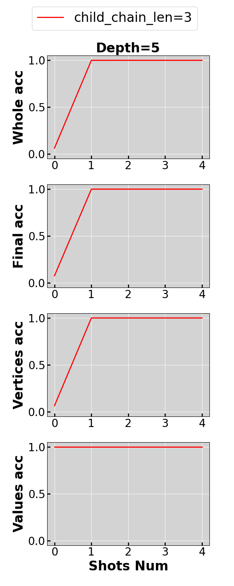

# Fragmented-at-Training-Chained-at-Testing
This is the repository of the paper [ICLR 2025] **Are Transformers Able to Reason by Connecting Separated Knowledge in Training Data?** (https://arxiv.org/abs/2501.15857). 
It includes the code that generates the “FTCT” (Fragmented at Training, Chained at Testing) learning task and corresponding experiments. 

## Environment Setup
Run  ```pip install -r requirements.txt```.

## Quick Start
By running ```quick_start.sh```, you can train and test Transformers on FTCT with depth 5 and child chain length 3. 

### Data Generation
Within ```quick_start.sh```, data generation is done by the following command.
```
python data_gen.py \
    --config-name config_normal.yaml\
    graph.len=$len \
    graph.type=$gt \
    data.max_child_chain_len=$child_len\
    paths.data_dir=$data_dir
```
It generates the data according to the procedure introduced in section 3 of the paper. 
After running, it creates the directory ```nodes_dir``` to store the causal structure and creates the directory ```data_and_models/quick_start/depth5_maxchild3/type0``` to store the training data.

### Training and Testing
Training and testing are done by the following command.
```
python main.py \
     --config-name config_normal.yaml\
    graph.len=$len \
    graph.type=$gt \
    data.max_child_chain_len=$child_len\
    paths.data_dir=$data_dir\
    modes.train=true\
    modes.test=true\
```

### Plotting
By running
```
python draw.py \
     --config-name config_normal.yaml\
    draw.parent_dir=$parent_dir\
    draw.mode=main\
    draw.model_size=quick_start
```
, you can draw the zero and few-shot testing performance of Transformers trained on FTCT with depth 5 and child chain length 3 stored. This image will be stored in the directory ```figures```.



## Replicate Experiments

All experiments are included in ```experiements.ipynb```. 

## Citation
```
@article{yin2025transformers,
  title={Are Transformers Able to Reason by Connecting Separated Knowledge in Training Data?},
  author={Yin, Yutong and Wang, Zhaoran},
  journal={arXiv preprint arXiv:2501.15857},
  year={2025}
}```